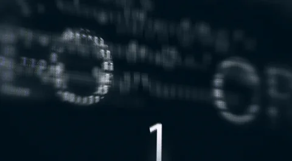

## Hello World 👋

 

Musicien (Bassiste)  
Sports (Padel)  
Jeux video (Jeux en ligne / Jeux Solo)  
Metaphysique et Sciences  

##  Mes Projets

### 🎮 Jeu en C - Castlevania 3D

> Base du jeu DOOM utilisant la technique du raycasting, sur le thème de Castlevania.

---

### 🐳 Docker - API Node.js

> API REST développée avec Node.js et conteneurisée avec Docker.

---

### 🌐 Site Web HTML/CSS

> Page portfolio responsive en HTML/CSS.

---

### 🧠 Algo en C++

> Implémentation et visualisation d’un algorithme de tri rapide en C++.
